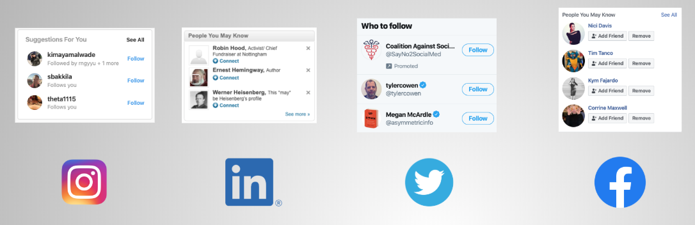
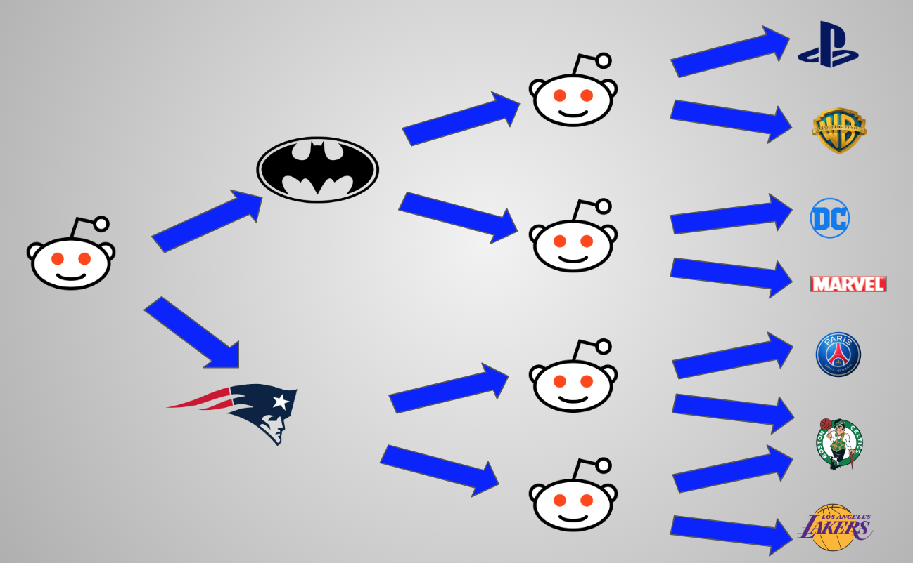
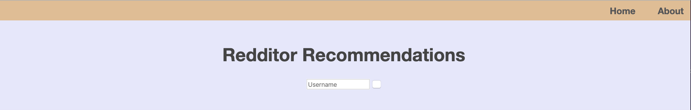
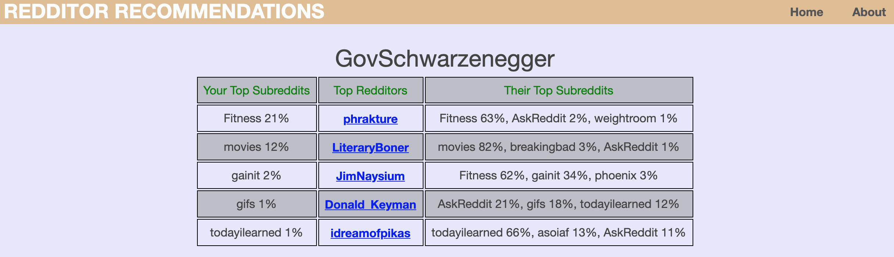

# Redditor Recommendations
To use the app, visit [swiftaugur.club](http://swiftaugur.club).

## Background

Most social media sites recommend users that a given person may want to friend or follow. For examples, on Facebook, Instagram, Twitter, and LinkedIn, the following are typically displayed somewhere on the frontpage:

On Reddit, however, one finds only recommendations for specific subreddits (i.e. communities organized by topic discussion) rather than for individual users, such as the following:

Reddit has two features that allows users to more easily find posts by specific users. The first is the "friend" feature, which allows users to have posts by all of those they have marked as friends collected in a single subreddit, r/friends. The second is the "follow" feature, which publishes posts by people that the user follows directly to the front page. Both features are sparingly used. The follow button is currently located on the profile pages of users, as in the following:

There is an argument to be made that keeping the focus of Reddit on discussions, rather than individual posters, is what would be best for keeping the original spirit of the website. However, given that shifting the focus to individuals would attract celebrities, influencers, and advertisers, it is understable that Reddit would face strong financial pressure to promote its "follow" feature. Indeed, Reddit announced in the summer of 2019 that it will soon enact greater transparency protocols (in particular, allowing redditors to view who follows them), signaling a possible new direction for the site.

## The Redditor Recommendations App

In addition to bolstering transparency and privacy, implementing a system for recommendation specific redditors will likely also be eventually be part of Reddit's plan for growing its follow feature. The app in this Github repo, Redditor Recommendations (RR), demonstrates one way that this can be done for the 10% of the site's 300 million users who comment and post, who may be the most likely to adopt and promote new features like the follow button. RR does this by combing through years of comment history to determine the top subreddits of each user (as ranked by the cumulative score, or karma, gained by the user on those subs), and then recommends the top contributors to those subs. For example, in the following image

the two subreddits from which the user has reaped the most karma are the Batman and Patriots themed subeddits. The redditors in the second column of the image are those with the highest scores on those two subreddits, and are thus the redditors that RR recommends to the original user as accounts to follow. In addition to the redditor recommendation, RR also provides the top subreddits that those redditors receive karma from. Listing these subreddits is done primarily to provide a better picture of who the new person is that the user may start following, but it is also beneficial to have this list serve as subreddit recommendation system in tself. 

The homepage of the app (when it is activated) is located at [swiftaugur.club](http://swiftaugur.club), and currently looks as follows:

The following is an example of the results when a valid username is entered:

In this example, the username is that of the celebrity, Arnold Schwarzenegger. The first column displays his top five subreddits, and the percentages show the amount of Schwarzenegger's total karma that is due to those subreddits (e.g., 21% of Schwarzenegger's karma is due to his posts on the Fitness subreddit). The second colun displays the top contributors to those subreddits, with hyperlinks to those redditors' profile pages so as to encourage use of the "follow" button. The third column displays these redditors' top three subreddits, so as to provide the original user a preliminary taste of the redditors' personality before clicking through to their profiles.

## Data Source

Reddit comment data is scraped and stored by a data scientist whose username is u/Stuck_In_the_matrix, and who may be contacted at jason@pushshift.io. The comments are uploaded monthly as JSONS to [this site](https://files.pushshift.io/reddit/comments/). The data that are currently avaiable represent the period from the founding of Reddit in December, 2015, up to September, 2019, and constitutes well over 2 terabytes. The RR app, however, currently only supports queries based on data up to March, 2016 (roughly 1.2 terabytes). Data from April, 2016, to September, 2019 is currently being processed and will be integrated in a later version of the app.  

## Architecture

The pipeline for ingesting, cleaning, processing, storing, and querying the data is represented in the following picture:

The scraped reddit comment data is downloaded, unzipped, and stored in an Amazon S3 bucket. From there, it is stripped down to a dataframe consisting solely of the name of the author of the comment, the name of the subreddit to which the comment was posted, and the score of the comment. For each author, subreddit, and author-subreddit combination, the cumulative score across the entire time period is computed, with the aid of parallelization through Spark. The resulting three csv files (corredponding to authors, subreddits, and author-subreddit relationships) are then imported to the Neo4j graph database. A front-end app fetches from this database the results of queries handled by a Flask-built front end UI. Everything described here was performed on AWS EC2 instances.
