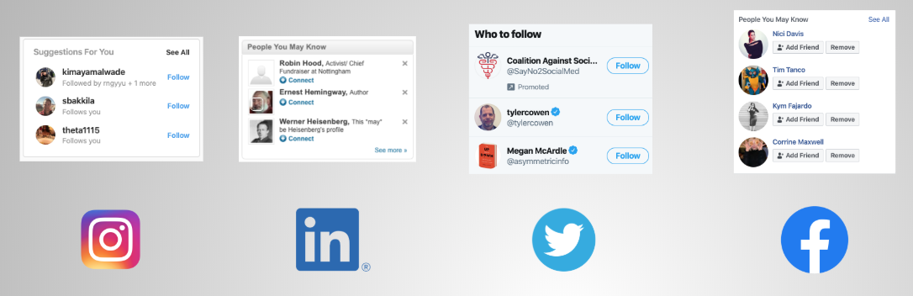

# Redditor Recommendations

Most social media sites recommend users that a given person may want to friend or follow. For examples, on Facebook, Instagram, Twitter, and LinkedIn, the following are typically displayed somewhere on the frontpage:

On Reddit, however, one finds only recommendations for specific subreddits (i.e. communities organized by topic discussion) rather than for individual users, such as the following
